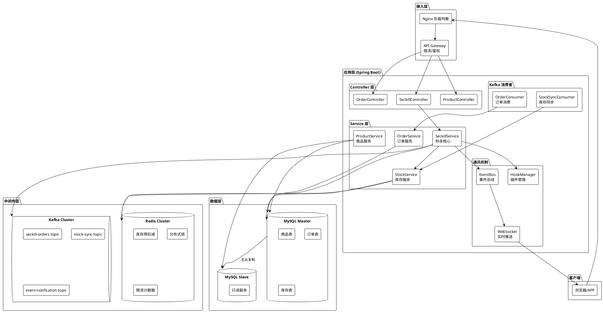

# 商品库存与秒杀系统 - 系统概述与架构设计

> 日期：2026/03/04
> 版本：v1.0

## 1. 项目背景

秒杀（Flash Sale）是电商平台中最具挑战性的业务场景之一。其核心特征是：

- **瞬时高并发**：数十万甚至百万用户在同一秒发起请求
- **库存有限**：商品数量远少于请求数量（例如 100 件商品，10 万人抢购）
- **强一致性**：绝不允许超卖（库存扣为负数）
- **快速响应**：用户体验要求毫秒级响应

本系统基于 Spring Boot + MyBatis + MySQL + Redis + Kafka 技术栈，设计一套完整的秒杀解决方案。

## 2. 技术栈选型

| 层级 | 技术 | 用途 |
|------|------|------|
| Web 层 | Spring Boot WebMVC | REST API、请求入口 |
| 实时推送 | Spring WebSocket | 秒杀结果实时推送、库存变化通知 |
| 缓存层 | Redis | 库存预扣减、分布式锁、限流计数、Session |
| 消息队列 | Apache Kafka | 异步下单、流量削峰、事件通知 |
| 持久层 | MyBatis + MySQL | 订单持久化、商品管理、库存最终一致 |
| 会话管理 | Spring Session (JDBC) | 分布式会话 |
| 工具库 | Lombok | 减少样板代码 |

## 3. 系统架构总览

### 3.1 分层架构

```
┌─────────────────────────────────────────────────────┐
│                    客户端 (Browser/App)               │
├─────────────────────────────────────────────────────┤
│                  Nginx / Gateway 层                   │
│          (静态资源CDN + 请求限流 + 负载均衡)           │
├─────────────────────────────────────────────────────┤
│                  Spring Boot 应用层                    │
│  ┌───────────┬───────────┬───────────┬────────────┐ │
│  │ Controller│   Event   │   Hook    │  WebSocket │ │
│  │   REST    │   Bus     │  Plugin   │   Push     │ │
│  └─────┬─────┴─────┬─────┴─────┬─────┴──────┬─────┘ │
│  ┌─────┴───────────┴───────────┴────────────┴─────┐ │
│  │              Service 业务逻辑层                   │ │
│  │  (秒杀服务 / 订单服务 / 商品服务 / 库存服务)       │ │
│  └─────┬──────────────┬───────────────────┬───────┘ │
│  ┌─────┴─────┐  ┌─────┴─────┐  ┌─────────┴───────┐ │
│  │   Redis   │  │   Kafka   │  │  MyBatis + MySQL │ │
│  │  缓存层   │  │  消息队列  │  │    持久层        │ │
│  └───────────┘  └───────────┘  └─────────────────┘  │
└─────────────────────────────────────────────────────┘
```

### 3.2 架构 PlantUML



## 4. 核心设计原则

### 4.1 读写分离，分层过滤

秒杀请求处理的核心思想是**漏斗模型**——在每一层尽可能多地过滤无效请求：

```
用户请求 (100,000 QPS)
    │
    ▼
Nginx 限流 (过滤 50%)  ──→ 50,000 QPS
    │
    ▼
接口层限流 + 校验       ──→ 10,000 QPS
(重复请求/非法请求过滤)
    │
    ▼
Redis 库存预扣减        ──→ 100 有效请求
(原子操作, 毫秒级)
    │
    ▼
Kafka 异步下单          ──→ 100 订单消息
(削峰填谷)
    │
    ▼
MySQL 持久化            ──→ 100 订单记录
(最终一致性保证)
```

### 4.2 四大核心保障

| 目标 | 方案 |
|------|------|
| **高并发** | Redis 原子扣减 + Kafka 削峰 + 分层过滤 |
| **高可用** | Redis Cluster + Kafka 多副本 + MySQL 主从 + 服务无状态 |
| **快响应** | Redis 内存操作 (<1ms) + 异步下单 + WebSocket 推送结果 |
| **强一致** | Redis Lua 原子脚本 + Kafka 顺序消费 + MySQL 乐观锁兜底 |

## 5. 部署拓扑

```plantuml
@startuml deployment
!theme plain

node "用户端" {
    [浏览器] as Browser
}

cloud "CDN" {
    [静态资源] as CDN
}

node "接入层" {
    [Nginx-1] as N1
    [Nginx-2] as N2
}

node "应用集群" {
    [App-1\nSpring Boot] as App1
    [App-2\nSpring Boot] as App2
    [App-3\nSpring Boot] as App3
}

node "Redis Cluster" {
    [Redis Master-1] as RM1
    [Redis Master-2] as RM2
    [Redis Master-3] as RM3
}

node "Kafka Cluster" {
    [Broker-1] as KB1
    [Broker-2] as KB2
    [Broker-3] as KB3
}

node "数据库" {
    [MySQL Master] as DBM
    [MySQL Slave-1] as DBS1
    [MySQL Slave-2] as DBS2
}

Browser --> CDN
Browser --> N1
Browser --> N2
N1 --> App1
N1 --> App2
N2 --> App2
N2 --> App3

App1 --> RM1
App2 --> RM2
App3 --> RM3

App1 --> KB1
App2 --> KB2
App3 --> KB3

KB1 --> DBM
KB2 --> DBM
KB3 --> DBM

DBM --> DBS1 : 主从同步
DBM --> DBS2 : 主从同步

@enduml
```

## 6. 项目模块划分

```
com.example.demo
├── config/                  # 配置类
│   ├── RedisConfig          # Redis 连接与序列化配置
│   ├── KafkaConfig          # Kafka 生产者/消费者配置
│   ├── MyBatisConfig        # MyBatis 配置
│   └── WebSocketConfig      # WebSocket 配置
├── controller/              # REST 控制器
│   ├── SeckillController    # 秒杀入口接口
│   ├── ProductController    # 商品管理接口
│   └── OrderController      # 订单查询接口
├── service/                 # 业务逻辑层
│   ├── SeckillService       # 秒杀核心逻辑
│   ├── OrderService         # 订单生命周期管理
│   ├── ProductService       # 商品CRUD
│   └── StockService         # 库存管理（Redis+MySQL双写）
├── mapper/                  # MyBatis Mapper 接口
│   ├── ProductMapper
│   ├── OrderMapper
│   └── StockMapper
├── model/                   # 数据模型
│   ├── entity/              # 数据库实体
│   ├── dto/                 # 数据传输对象
│   └── vo/                  # 视图对象
├── event/                   # 事件驱动机制
│   ├── EventBus             # 事件总线
│   ├── SeckillEvent         # 秒杀相关事件定义
│   └── listener/            # 事件监听器
├── hook/                    # Hook 插件化机制
│   ├── HookManager          # Hook 管理器
│   ├── HookPoint            # Hook 切入点枚举
│   └── plugins/             # 插件实现
├── mq/                      # Kafka 消息队列
│   ├── producer/            # 消息生产者
│   └── consumer/            # 消息消费者
├── websocket/               # WebSocket 推送
│   ├── SeckillWebSocket     # 秒杀结果推送
│   └── StockWebSocket       # 库存变化推送
├── common/                  # 公共组件
│   ├── Result               # 统一响应封装
│   ├── ErrorCode            # 错误码定义
│   └── Constants            # 常量定义
└── util/                    # 工具类
    ├── RedisLockUtil        # 分布式锁工具
    └── RateLimiter          # 限流器
```

## 7. 下一步

- [02-数据库设计.md](02-数据库设计.md) - 详细表结构与 MyBatis 映射
- [03-功能模块设计.md](03-功能模块设计.md) - 各模块详细设计与业务流程
- [04-高并发解决方案.md](04-高并发解决方案.md) - 并发控制与一致性保障
- [05-通讯与扩展机制.md](05-通讯与扩展机制.md) - Event/Hook/MQ/WebSocket 设计
- [06-API接口设计.md](06-API接口设计.md) - RESTful API 规范
- [07-页面原型设计.md](07-页面原型设计.md) - 前端页面原型
