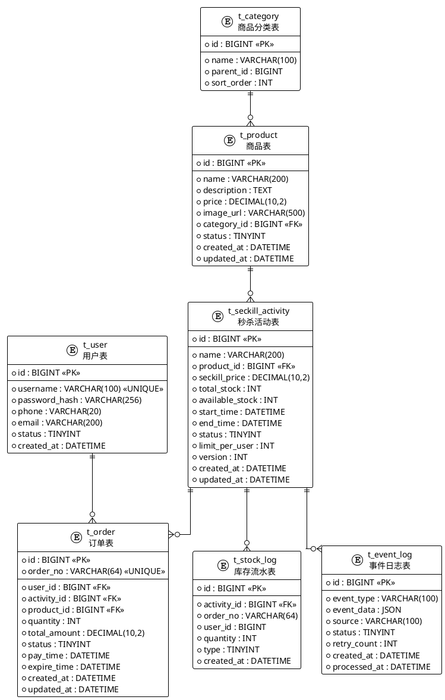

# 商品库存与秒杀系统 - 数据库设计

> 日期：2026/03/04
> 版本：v1.0

## 1. ER 关系图



## 2. 表结构详细设计

### 2.1 商品分类表 (t_category)

```sql
CREATE TABLE t_category (
    id          BIGINT AUTO_INCREMENT PRIMARY KEY,
    name        VARCHAR(100) NOT NULL COMMENT '分类名称',
    parent_id   BIGINT DEFAULT 0 COMMENT '父分类ID，0为顶级分类',
    sort_order  INT DEFAULT 0 COMMENT '排序权重',
    created_at  DATETIME DEFAULT CURRENT_TIMESTAMP,
    INDEX idx_parent(parent_id)
) ENGINE=InnoDB DEFAULT CHARSET=utf8mb4 COMMENT='商品分类表';
```

### 2.2 商品表 (t_product)

```sql
CREATE TABLE t_product (
    id           BIGINT AUTO_INCREMENT PRIMARY KEY,
    name         VARCHAR(200) NOT NULL COMMENT '商品名称',
    description  TEXT COMMENT '商品描述',
    price        DECIMAL(10,2) NOT NULL COMMENT '原价',
    image_url    VARCHAR(500) COMMENT '商品图片URL',
    category_id  BIGINT NOT NULL COMMENT '分类ID',
    status       TINYINT DEFAULT 1 COMMENT '状态: 0下架 1上架',
    created_at   DATETIME DEFAULT CURRENT_TIMESTAMP,
    updated_at   DATETIME DEFAULT CURRENT_TIMESTAMP ON UPDATE CURRENT_TIMESTAMP,
    INDEX idx_category(category_id),
    INDEX idx_status(status)
) ENGINE=InnoDB DEFAULT CHARSET=utf8mb4 COMMENT='商品表';
```

### 2.3 秒杀活动表 (t_seckill_activity) — 核心表

```sql
CREATE TABLE t_seckill_activity (
    id              BIGINT AUTO_INCREMENT PRIMARY KEY,
    name            VARCHAR(200) NOT NULL COMMENT '活动名称',
    product_id      BIGINT NOT NULL COMMENT '关联商品ID',
    seckill_price   DECIMAL(10,2) NOT NULL COMMENT '秒杀价格',
    total_stock     INT NOT NULL COMMENT '总库存',
    available_stock INT NOT NULL COMMENT '可用库存（乐观锁扣减）',
    start_time      DATETIME NOT NULL COMMENT '秒杀开始时间',
    end_time        DATETIME NOT NULL COMMENT '秒杀结束时间',
    status          TINYINT DEFAULT 0 COMMENT '状态: 0未开始 1进行中 2已结束 3已取消',
    limit_per_user  INT DEFAULT 1 COMMENT '每人限购数量',
    version         INT DEFAULT 0 COMMENT '乐观锁版本号',
    created_at      DATETIME DEFAULT CURRENT_TIMESTAMP,
    updated_at      DATETIME DEFAULT CURRENT_TIMESTAMP ON UPDATE CURRENT_TIMESTAMP,
    INDEX idx_product(product_id),
    INDEX idx_status_time(status, start_time, end_time),
    INDEX idx_start_time(start_time)
) ENGINE=InnoDB DEFAULT CHARSET=utf8mb4 COMMENT='秒杀活动表';
```

**设计要点**：
- `available_stock` + `version` 实现**乐观锁**扣减，作为 Redis 扣减后的数据库兜底
- `limit_per_user` 控制单用户购买上限，防止恶意刷单

### 2.4 订单表 (t_order)

```sql
CREATE TABLE t_order (
    id            BIGINT AUTO_INCREMENT PRIMARY KEY,
    order_no      VARCHAR(64) NOT NULL UNIQUE COMMENT '订单号（雪花算法生成）',
    user_id       BIGINT NOT NULL COMMENT '用户ID',
    activity_id   BIGINT NOT NULL COMMENT '秒杀活动ID',
    product_id    BIGINT NOT NULL COMMENT '商品ID',
    quantity      INT NOT NULL DEFAULT 1 COMMENT '购买数量',
    total_amount  DECIMAL(10,2) NOT NULL COMMENT '订单总金额',
    status        TINYINT DEFAULT 0 COMMENT '状态: 0待支付 1已支付 2已取消 3已退款 4已超时',
    pay_time      DATETIME COMMENT '支付时间',
    expire_time   DATETIME NOT NULL COMMENT '订单过期时间（未支付自动取消）',
    created_at    DATETIME DEFAULT CURRENT_TIMESTAMP,
    updated_at    DATETIME DEFAULT CURRENT_TIMESTAMP ON UPDATE CURRENT_TIMESTAMP,
    UNIQUE INDEX uk_user_activity(user_id, activity_id) COMMENT '防止同一用户同一活动重复下单',
    INDEX idx_user(user_id),
    INDEX idx_activity(activity_id),
    INDEX idx_status(status),
    INDEX idx_expire_time(expire_time, status)
) ENGINE=InnoDB DEFAULT CHARSET=utf8mb4 COMMENT='秒杀订单表';
```

**设计要点**：
- `uk_user_activity` 唯一索引从数据库层面保证**一人一单**
- `expire_time` 配合定时任务实现未支付订单自动关闭并回滚库存

### 2.5 用户表 (t_user)

```sql
CREATE TABLE t_user (
    id             BIGINT AUTO_INCREMENT PRIMARY KEY,
    username       VARCHAR(100) NOT NULL UNIQUE COMMENT '用户名',
    password_hash  VARCHAR(256) NOT NULL COMMENT '密码哈希',
    phone          VARCHAR(20) COMMENT '手机号',
    email          VARCHAR(200) COMMENT '邮箱',
    status         TINYINT DEFAULT 1 COMMENT '状态: 0禁用 1正常',
    created_at     DATETIME DEFAULT CURRENT_TIMESTAMP,
    INDEX idx_phone(phone)
) ENGINE=InnoDB DEFAULT CHARSET=utf8mb4 COMMENT='用户表';
```

### 2.6 库存流水表 (t_stock_log)

```sql
CREATE TABLE t_stock_log (
    id            BIGINT AUTO_INCREMENT PRIMARY KEY,
    activity_id   BIGINT NOT NULL COMMENT '秒杀活动ID',
    order_no      VARCHAR(64) COMMENT '关联订单号',
    user_id       BIGINT COMMENT '用户ID',
    quantity      INT NOT NULL COMMENT '变化数量（正数补货，负数扣减）',
    type          TINYINT NOT NULL COMMENT '类型: 1扣减 2回滚 3手动补货',
    created_at    DATETIME DEFAULT CURRENT_TIMESTAMP,
    INDEX idx_activity(activity_id),
    INDEX idx_order(order_no)
) ENGINE=InnoDB DEFAULT CHARSET=utf8mb4 COMMENT='库存流水表';
```

**用途**：库存对账与审计，追踪每一笔库存变化来源。

### 2.7 事件日志表 (t_event_log)

```sql
CREATE TABLE t_event_log (
    id            BIGINT AUTO_INCREMENT PRIMARY KEY,
    event_type    VARCHAR(100) NOT NULL COMMENT '事件类型',
    event_data    JSON COMMENT '事件数据(JSON)',
    source        VARCHAR(100) COMMENT '事件来源',
    status        TINYINT DEFAULT 0 COMMENT '状态: 0待处理 1已处理 2处理失败',
    retry_count   INT DEFAULT 0 COMMENT '重试次数',
    created_at    DATETIME DEFAULT CURRENT_TIMESTAMP,
    processed_at  DATETIME COMMENT '处理时间',
    INDEX idx_type_status(event_type, status),
    INDEX idx_created(created_at)
) ENGINE=InnoDB DEFAULT CHARSET=utf8mb4 COMMENT='事件日志表';
```

**用途**：事件溯源（Event Sourcing），所有领域事件持久化，支持重放和补偿。

## 3. MyBatis Mapper 设计

### 3.1 核心 Mapper — StockMapper（库存扣减乐观锁）

```xml
<!-- StockMapper.xml -->
<mapper namespace="com.example.demo.mapper.StockMapper">

    <!-- 乐观锁扣减库存 —— 防超卖的最后一道防线 -->
    <update id="deductStockOptimistic">
        UPDATE t_seckill_activity
        SET available_stock = available_stock - #{quantity},
            version = version + 1,
            updated_at = NOW()
        WHERE id = #{activityId}
          AND available_stock >= #{quantity}
          AND version = #{version}
    </update>

    <!-- 回滚库存（订单取消/超时） -->
    <update id="rollbackStock">
        UPDATE t_seckill_activity
        SET available_stock = available_stock + #{quantity},
            version = version + 1,
            updated_at = NOW()
        WHERE id = #{activityId}
    </update>

    <!-- 查询当前库存与版本号 -->
    <select id="selectStockForUpdate" resultType="SeckillActivity">
        SELECT id, available_stock, version
        FROM t_seckill_activity
        WHERE id = #{activityId}
        FOR UPDATE
    </select>

</mapper>
```

### 3.2 OrderMapper

```xml
<!-- OrderMapper.xml -->
<mapper namespace="com.example.demo.mapper.OrderMapper">

    <insert id="insertOrder" parameterType="Order" useGeneratedKeys="true" keyProperty="id">
        INSERT INTO t_order (order_no, user_id, activity_id, product_id,
                             quantity, total_amount, status, expire_time)
        VALUES (#{orderNo}, #{userId}, #{activityId}, #{productId},
                #{quantity}, #{totalAmount}, #{status}, #{expireTime})
    </insert>

    <update id="updateOrderStatus">
        UPDATE t_order
        SET status = #{newStatus}, updated_at = NOW()
        WHERE order_no = #{orderNo} AND status = #{oldStatus}
    </update>

    <!-- 查询已过期未支付订单 -->
    <select id="selectExpiredOrders" resultType="Order">
        SELECT * FROM t_order
        WHERE status = 0
          AND expire_time &lt;= NOW()
        LIMIT #{limit}
    </select>

    <!-- 检查用户是否已参与活动 -->
    <select id="countByUserAndActivity" resultType="int">
        SELECT COUNT(*) FROM t_order
        WHERE user_id = #{userId}
          AND activity_id = #{activityId}
          AND status IN (0, 1)
    </select>

</mapper>
```

### 3.3 ProductMapper

```xml
<!-- ProductMapper.xml -->
<mapper namespace="com.example.demo.mapper.ProductMapper">

    <select id="selectById" resultType="Product">
        SELECT * FROM t_product WHERE id = #{id}
    </select>

    <select id="selectByCategory" resultType="Product">
        SELECT * FROM t_product
        WHERE category_id = #{categoryId} AND status = 1
        ORDER BY created_at DESC
        LIMIT #{offset}, #{limit}
    </select>

    <select id="selectSeckillProducts" resultType="SeckillProductVO">
        SELECT p.id, p.name, p.price, p.image_url,
               a.id AS activity_id, a.seckill_price,
               a.available_stock, a.start_time, a.end_time, a.status AS activity_status
        FROM t_product p
        INNER JOIN t_seckill_activity a ON p.id = a.product_id
        WHERE a.status IN (0, 1)
          AND a.end_time > NOW()
        ORDER BY a.start_time ASC
    </select>

</mapper>
```

## 4. 索引策略

| 表 | 索引名 | 字段 | 用途 |
|----|--------|------|------|
| t_seckill_activity | idx_status_time | (status, start_time, end_time) | 按状态和时间查询活动 |
| t_order | uk_user_activity | (user_id, activity_id) | 唯一约束防重复下单 |
| t_order | idx_expire_time | (expire_time, status) | 过期订单扫描 |
| t_stock_log | idx_activity | (activity_id) | 按活动查流水 |
| t_event_log | idx_type_status | (event_type, status) | 事件处理查询 |

## 5. Redis 数据结构设计

| Key 格式 | 类型 | 用途 | TTL |
|-----------|------|------|-----|
| `seckill:stock:{activityId}` | String (Integer) | 库存计数器 | 活动结束后1小时 |
| `seckill:bought:{activityId}:{userId}` | String (Integer) | 用户已购数量 | 活动结束后1小时 |
| `seckill:lock:{activityId}` | String | 分布式锁 | 10秒自动过期 |
| `seckill:activity:{activityId}` | Hash | 活动详情缓存 | 5分钟 |
| `product:detail:{productId}` | Hash | 商品详情缓存 | 10分钟 |
| `rate:limit:{userId}` | String (Counter) | 用户请求限流 | 1秒滑动窗口 |
