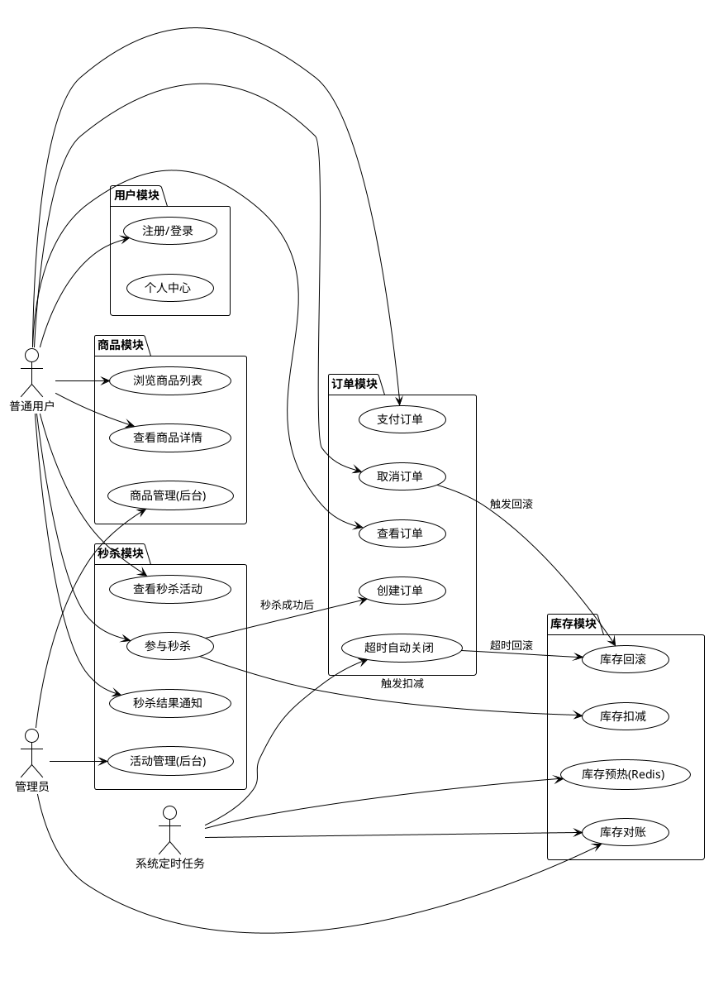
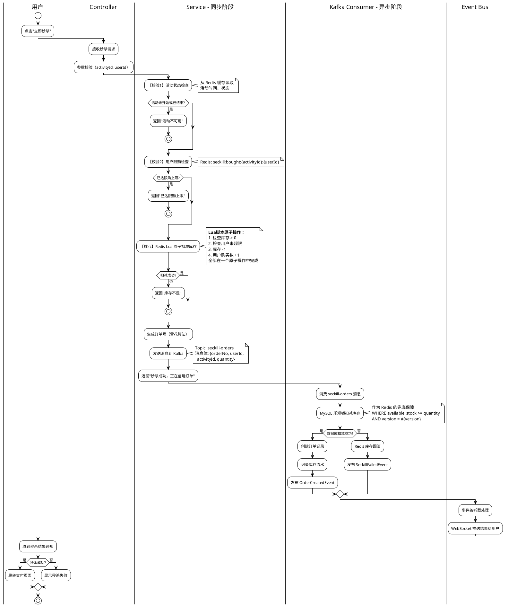
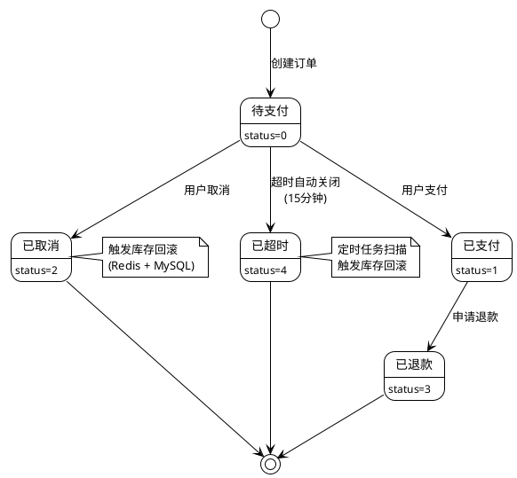
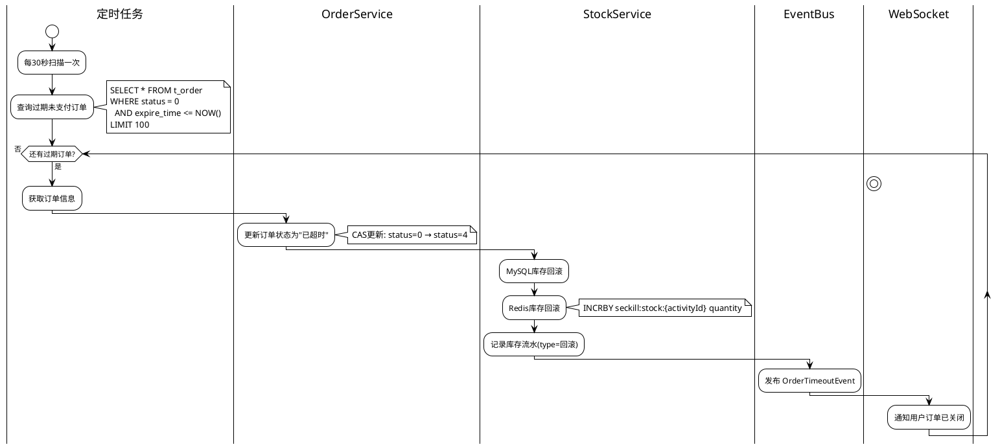
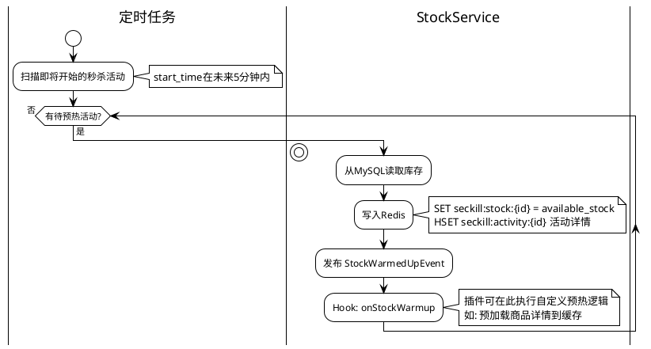
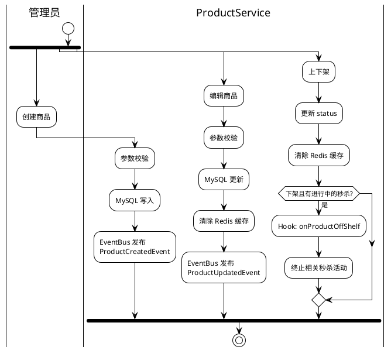
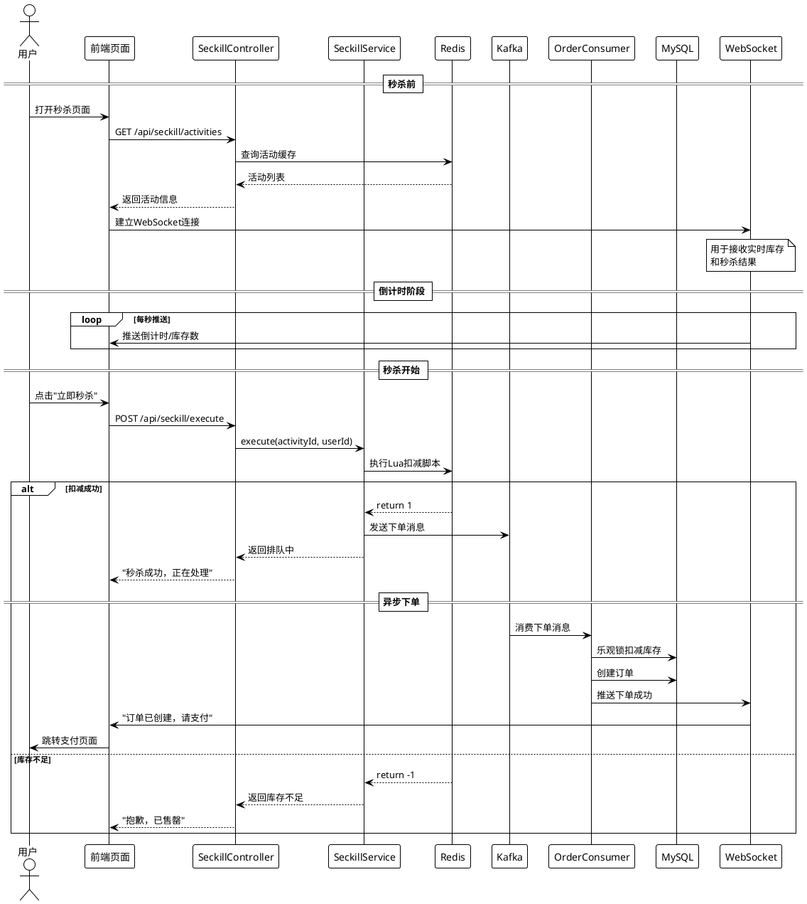

# 商品库存与秒杀系统 - 功能模块设计

> 日期：2026/03/04
> 版本：v1.0

## 1. 功能模块总览



## 2. 秒杀核心流程

### 2.1 秒杀主流程（同步+异步混合）



### 2.2 Redis Lua 原子扣减脚本

```lua
-- seckill_deduct.lua
-- KEYS[1] = seckill:stock:{activityId}
-- KEYS[2] = seckill:bought:{activityId}:{userId}
-- ARGV[1] = 限购数量
-- ARGV[2] = 购买数量

-- 检查库存
local stock = tonumber(redis.call('GET', KEYS[1]) or '0')
if stock < tonumber(ARGV[2]) then
    return -1  -- 库存不足
end

-- 检查用户已购数量
local bought = tonumber(redis.call('GET', KEYS[2]) or '0')
if bought + tonumber(ARGV[2]) > tonumber(ARGV[1]) then
    return -2  -- 超出限购
end

-- 原子扣减
redis.call('DECRBY', KEYS[1], ARGV[2])
redis.call('INCRBY', KEYS[2], ARGV[2])

return 1  -- 扣减成功
```

## 3. 订单生命周期

### 3.1 状态机



### 3.2 订单超时关闭流程



## 4. 库存管理

### 4.1 库存预热（活动开始前）



### 4.2 双写一致性保障

库存存在于 Redis 和 MySQL 两个存储中，一致性策略：

```
          Redis (快速路径)          MySQL (持久化)
              │                        │
   秒杀请求 ──┤                        │
              │ Lua原子扣减            │
              │ ←──成功──→             │
              │                        │
              │    Kafka 异步消息       │
              │ ──────────────────→    │
              │                    乐观锁扣减
              │                    ←成功/失败→
              │                        │
              │   失败则Redis回滚       │
              │ ←──────────────────    │
```

**一致性保障手段**：
1. Redis 扣减成功是前提
2. MySQL 乐观锁扣减作为最终确认
3. 失败时 Redis 回滚（补偿机制）
4. 定时对账任务兜底（Redis 库存 vs MySQL 库存）

## 5. 商品管理（后台）

### 5.1 商品 CRUD 流程



### 5.2 秒杀活动管理

| 操作 | 触发事件 | Hook 切入点 | 说明 |
|------|----------|-------------|------|
| 创建活动 | ActivityCreatedEvent | BEFORE_ACTIVITY_CREATE | 校验商品状态、时间冲突 |
| 开始活动 | ActivityStartedEvent | ON_ACTIVITY_START | 库存预热、开启WebSocket |
| 结束活动 | ActivityEndedEvent | ON_ACTIVITY_END | 清理Redis、关闭入口 |
| 取消活动 | ActivityCancelledEvent | ON_ACTIVITY_CANCEL | 回滚所有未支付订单 |

## 6. 用户购买流程（完整）



## 7. 非功能性需求

| 需求 | 指标 | 实现手段 |
|------|------|----------|
| 响应时间 | 秒杀接口 < 50ms | Redis 内存操作 + 异步下单 |
| 吞吐量 | > 10,000 QPS | 分层过滤 + Kafka 削峰 |
| 可用性 | 99.9% | 多实例部署 + 中间件集群 |
| 一致性 | 零超卖 | Redis Lua 原子 + MySQL 乐观锁 |
| 数据完整性 | 订单不丢失 | Kafka 持久化 + MySQL 事务 |
