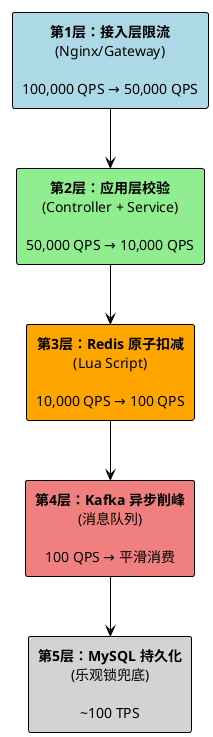
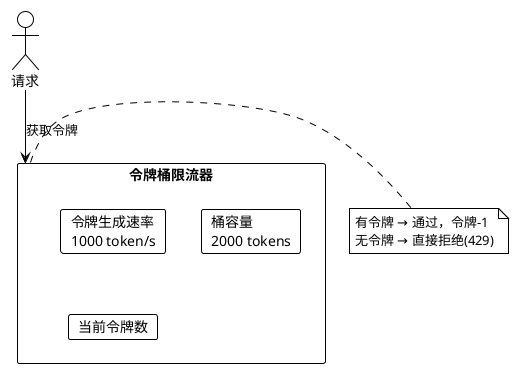
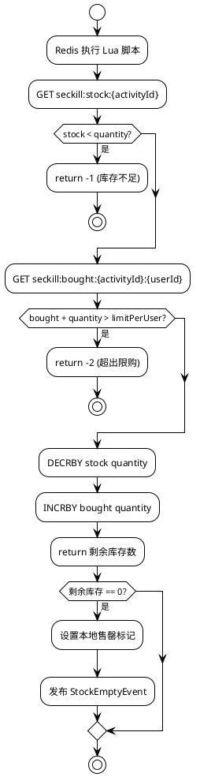
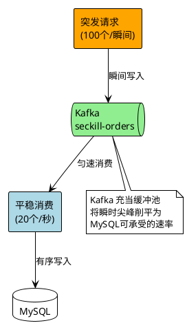
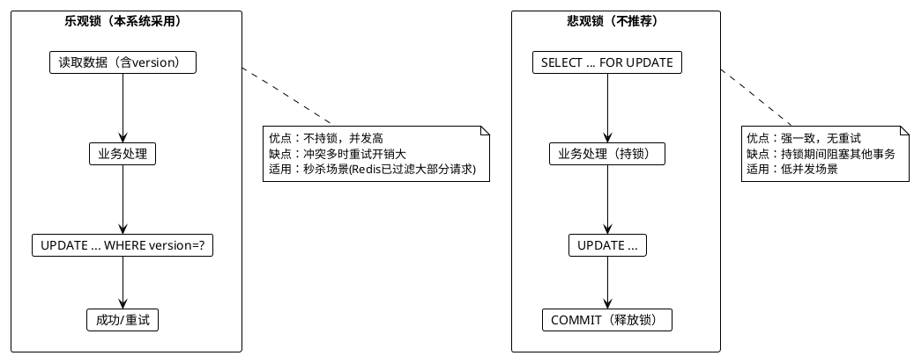
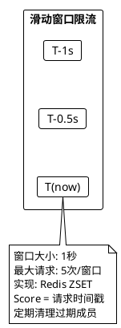
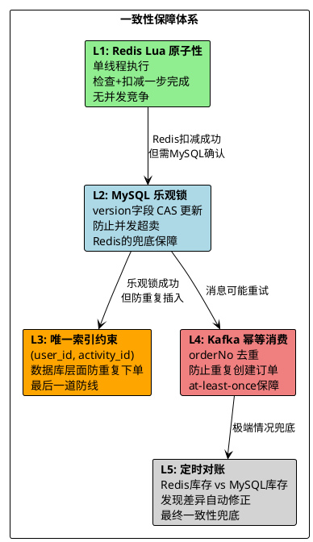

# 商品库存与秒杀系统 - 高并发解决方案

> 日期：2026/03/04
> 版本：v1.0

## 1. 总体策略：漏斗模型

高并发秒杀的核心思想是**分层过滤**，在每一层尽早拒绝无效请求，只让最少的请求到达数据库。



## 2. 第1层：接入层限流

### 2.1 Nginx 限流配置

```nginx
# 基于IP的请求速率限制
limit_req_zone $binary_remote_addr zone=seckill:10m rate=10r/s;

server {
    location /api/seckill/execute {
        # 突发请求最多排队20个，超出直接返回503
        limit_req zone=seckill burst=20 nodelay;

        # 单个IP最大并发连接数
        limit_conn perip 5;

        proxy_pass http://backend;
    }
}
```

### 2.2 Gateway 层令牌桶限流



## 3. 第2层：应用层校验（快速失败）

在进入 Redis 操作前，先进行一系列**零成本校验**：

```java
public Result<String> executeSeckill(Long activityId, Long userId) {
    // 1. 活动状态校验（本地缓存，无需网络请求）
    if (!activityLocalCache.isActive(activityId)) {
        return Result.fail(ErrorCode.ACTIVITY_NOT_ACTIVE);
    }

    // 2. 内存标记：库存售罄标记（避免无效Redis请求）
    if (stockSoldOutMap.getOrDefault(activityId, false)) {
        return Result.fail(ErrorCode.STOCK_EMPTY);
    }

    // 3. 用户黑名单/风控检查
    if (riskControlService.isBlocked(userId)) {
        return Result.fail(ErrorCode.USER_BLOCKED);
    }

    // 4. 请求频率检查（Redis INCR + TTL 滑动窗口）
    if (rateLimiter.isExceeded(userId, 5, 1)) {  // 每秒最多5次
        return Result.fail(ErrorCode.RATE_LIMITED);
    }

    // 通过所有校验，进入Redis扣减环节
    return doSeckill(activityId, userId);
}
```

**关键优化：内存售罄标记**

```java
// 当Redis库存扣为0时，设置本地标记
// 后续相同活动的请求直接在内存中拒绝，无需访问Redis
private ConcurrentHashMap<Long, Boolean> stockSoldOutMap = new ConcurrentHashMap<>();

// 扣减返回-1（库存不足）时
stockSoldOutMap.put(activityId, true);

// 库存回滚时清除标记
stockSoldOutMap.remove(activityId);
```

## 4. 第3层：Redis 原子扣减

### 4.1 Lua 脚本设计

Redis 执行 Lua 脚本是**单线程原子**的，天然避免了并发竞争：

```lua
-- seckill_deduct.lua
-- 单次调用完成：库存检查 + 限购检查 + 扣减 + 计数
-- 时间复杂度 O(1)，执行时间 < 0.1ms

local stockKey = KEYS[1]      -- seckill:stock:{activityId}
local boughtKey = KEYS[2]     -- seckill:bought:{activityId}:{userId}
local limitPerUser = tonumber(ARGV[1])
local quantity = tonumber(ARGV[2])

-- Step 1: 检查库存
local stock = tonumber(redis.call('GET', stockKey) or '0')
if stock < quantity then
    return -1  -- 库存不足
end

-- Step 2: 检查用户限购
local bought = tonumber(redis.call('GET', boughtKey) or '0')
if bought + quantity > limitPerUser then
    return -2  -- 超出限购
end

-- Step 3: 原子扣减
redis.call('DECRBY', stockKey, quantity)
redis.call('INCRBY', boughtKey, quantity)

-- Step 4: 返回剩余库存（用于判断是否售罄）
return tonumber(redis.call('GET', stockKey))
```

### 4.2 扣减流程图



### 4.3 性能指标

| 操作 | 耗时 | QPS |
|------|------|-----|
| Lua 脚本执行 | < 0.1ms | > 100,000 |
| 网络往返 (本机) | ~0.5ms | ~20,000 |
| 网络往返 (跨机) | ~1ms | ~10,000 |

## 5. 第4层：Kafka 异步削峰

### 5.1 为什么需要 Kafka

Redis 扣减成功后，如果同步写 MySQL，会导致：
- MySQL 成为瓶颈（InnoDB 行锁，TPS ~1000）
- 用户等待时间增加（MySQL 写入 ~5-20ms）
- 数据库连接池耗尽风险

Kafka 的作用：将峰值流量转化为平稳流量。



### 5.2 消息设计

```java
// Kafka 消息体
@Data
public class SeckillOrderMessage {
    private String orderNo;       // 预生成的订单号
    private Long userId;
    private Long activityId;
    private Long productId;
    private Integer quantity;
    private BigDecimal totalAmount;
    private LocalDateTime createTime;
}
```

### 5.3 消费者设计要点

```java
@KafkaListener(topics = "seckill-orders", groupId = "order-consumer")
public void consumeSeckillOrder(SeckillOrderMessage message) {
    try {
        // 1. 幂等性检查（防止重复消费）
        if (orderMapper.countByOrderNo(message.getOrderNo()) > 0) {
            log.warn("重复消息，跳过: {}", message.getOrderNo());
            return;
        }

        // 2. MySQL 乐观锁扣减（兜底）
        int rows = stockMapper.deductStockOptimistic(
            message.getActivityId(),
            message.getQuantity(),
            currentVersion
        );

        if (rows == 0) {
            // MySQL 扣减失败 → Redis 回滚
            redisStockService.rollback(message.getActivityId(), message.getQuantity());
            eventBus.publish(new SeckillFailedEvent(message));
            return;
        }

        // 3. 创建订单
        orderService.createOrder(message);

        // 4. 发布成功事件
        eventBus.publish(new OrderCreatedEvent(message));

    } catch (Exception e) {
        // 异常处理 + 重试机制
        log.error("订单处理失败: {}", message.getOrderNo(), e);
        throw e;  // 抛出异常触发 Kafka 重试
    }
}
```

### 5.4 Kafka 配置要点

```yaml
spring:
  kafka:
    producer:
      # 保证消息不丢失
      acks: all
      retries: 3
      # 保证顺序性：按activityId分区
      key-serializer: org.apache.kafka.common.serialization.StringSerializer

    consumer:
      # 手动提交offset，保证消费可靠性
      enable-auto-commit: false
      auto-offset-reset: earliest
      # 单线程消费保证顺序
      max-poll-records: 10
```

## 6. 第5层：MySQL 乐观锁兜底

### 6.1 乐观锁扣减

```sql
UPDATE t_seckill_activity
SET available_stock = available_stock - #{quantity},
    version = version + 1
WHERE id = #{activityId}
  AND available_stock >= #{quantity}
  AND version = #{version}
```

**关键**：`AND version = #{version}` 保证了并发安全。如果两个请求同时到达，只有一个能成功，另一个 `affected_rows = 0`。

### 6.2 乐观锁 vs 悲观锁 对比



## 7. 分布式锁

### 7.1 使用场景

| 场景 | 锁 Key | 用途 |
|------|--------|------|
| 库存预热 | `lock:warmup:{activityId}` | 防止多实例重复预热 |
| 库存对账 | `lock:reconcile:{activityId}` | 防止并发对账 |
| 订单超时扫描 | `lock:timeout:scan` | 防止多实例重复扫描 |

### 7.2 Redis 分布式锁实现

```java
public class RedisLockUtil {

    /**
     * 获取分布式锁
     * @param lockKey  锁的Key
     * @param requestId 请求标识（用于安全释放）
     * @param expireMs  过期时间（防死锁）
     */
    public boolean tryLock(String lockKey, String requestId, long expireMs) {
        Boolean result = redisTemplate.opsForValue()
            .setIfAbsent(lockKey, requestId, expireMs, TimeUnit.MILLISECONDS);
        return Boolean.TRUE.equals(result);
    }

    /**
     * 释放锁（Lua 脚本保证原子性：只释放自己的锁）
     */
    public boolean unlock(String lockKey, String requestId) {
        String script =
            "if redis.call('GET', KEYS[1]) == ARGV[1] then " +
            "  return redis.call('DEL', KEYS[1]) " +
            "else return 0 end";
        Long result = redisTemplate.execute(
            new DefaultRedisScript<>(script, Long.class),
            List.of(lockKey), requestId);
        return Long.valueOf(1).equals(result);
    }
}
```

## 8. 限流方案

### 8.1 滑动窗口限流（Redis 实现）



```java
public boolean isExceeded(Long userId, int maxCount, int windowSeconds) {
    String key = "rate:limit:" + userId;
    long now = System.currentTimeMillis();
    long windowStart = now - windowSeconds * 1000L;

    // Lua脚本原子操作
    String script =
        "redis.call('ZREMRANGEBYSCORE', KEYS[1], 0, ARGV[1])\n" +
        "local count = redis.call('ZCARD', KEYS[1])\n" +
        "if count < tonumber(ARGV[2]) then\n" +
        "  redis.call('ZADD', KEYS[1], ARGV[3], ARGV[3])\n" +
        "  redis.call('EXPIRE', KEYS[1], ARGV[4])\n" +
        "  return 0\n" +
        "end\n" +
        "return 1";

    Long result = redisTemplate.execute(
        new DefaultRedisScript<>(script, Long.class),
        List.of(key),
        String.valueOf(windowStart),
        String.valueOf(maxCount),
        String.valueOf(now),
        String.valueOf(windowSeconds + 1)
    );
    return Long.valueOf(1).equals(result);
}
```

## 9. 一致性保障全景


