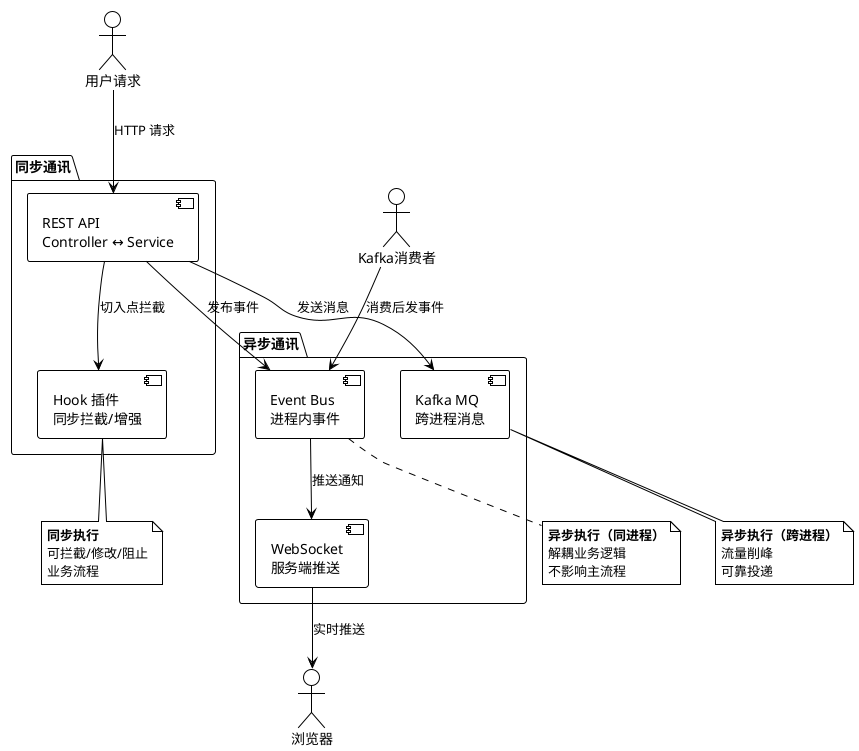
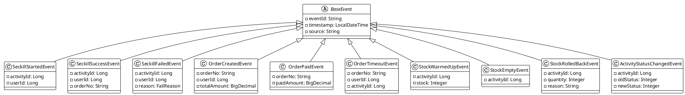
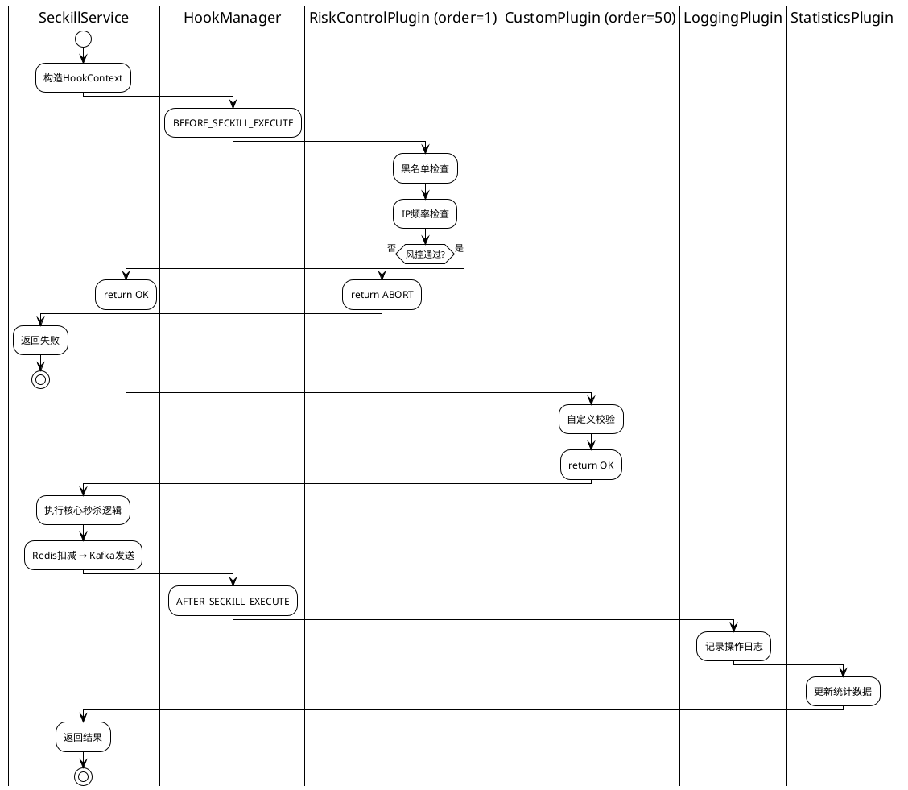
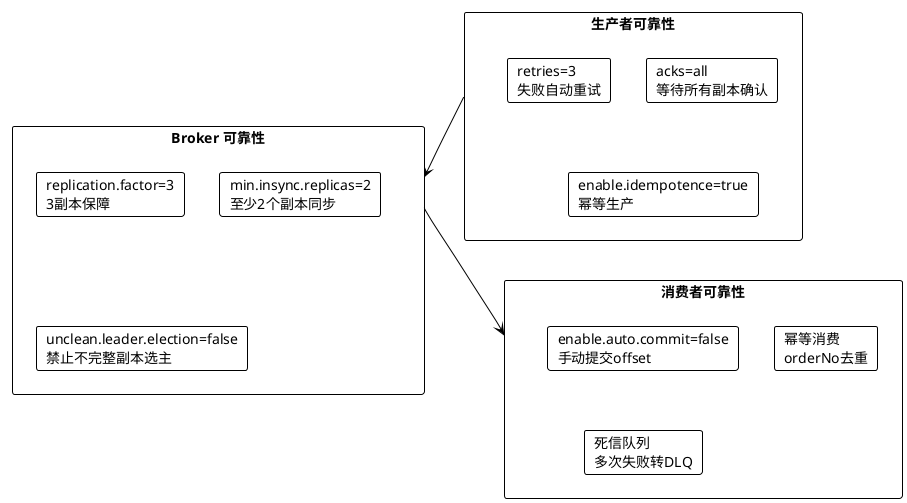
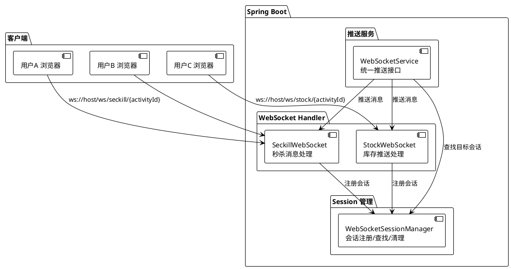
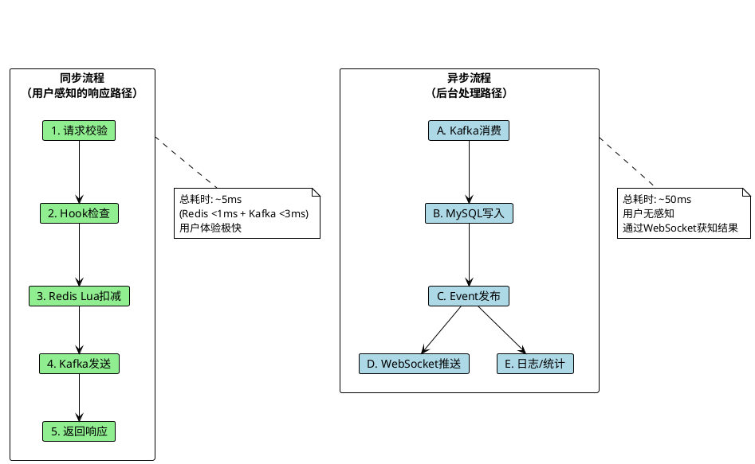

# 商品库存与秒杀系统 - 通讯与扩展机制

> 日期：2026/03/04
> 版本：v1.0

本文档详细设计系统中的四种通讯/扩展机制：**Event 事件总线**、**Hook 插件化**、**Kafka 消息队列**、**WebSocket 实时推送**。

## 1. 通讯机制全景



## 2. Event 事件总线

### 2.1 设计思想

使用 Spring ApplicationEvent 机制实现进程内事件驱动，解耦核心业务与辅助功能。

**核心原则**：主流程只做必要的事（Redis扣减 + Kafka发送），其他逻辑通过事件异步触发。

### 2.2 事件定义



### 2.3 事件总线实现

```java
/**
 * 基于 Spring ApplicationEventPublisher 的事件总线。
 * 支持同步和异步两种模式。
 */
@Component
public class EventBus {

    private final ApplicationEventPublisher publisher;
    private final EventLogMapper eventLogMapper;  // 事件持久化

    /**
     * 发布事件（异步执行监听器）
     */
    public void publish(BaseEvent event) {
        // 1. 事件持久化（用于溯源和重放）
        eventLogMapper.insert(EventLog.from(event));
        // 2. 发布到 Spring 事件机制
        publisher.publishEvent(event);
    }

    /**
     * 发布事件（同步执行，等待所有监听器完成）
     */
    public void publishSync(BaseEvent event) {
        eventLogMapper.insert(EventLog.from(event));
        publisher.publishEvent(event);
    }
}
```

### 2.4 事件监听器

```java
@Component
public class SeckillEventListener {

    /**
     * 秒杀成功 → 通过 WebSocket 推送给用户
     */
    @Async
    @EventListener
    public void onSeckillSuccess(SeckillSuccessEvent event) {
        webSocketService.sendToUser(event.getUserId(),
            new WsMessage("SECKILL_SUCCESS", event.getOrderNo()));
    }

    /**
     * 秒杀失败 → 通过 WebSocket 通知用户
     */
    @Async
    @EventListener
    public void onSeckillFailed(SeckillFailedEvent event) {
        webSocketService.sendToUser(event.getUserId(),
            new WsMessage("SECKILL_FAILED", event.getReason()));
    }

    /**
     * 库存售罄 → 通知所有在线用户
     */
    @Async
    @EventListener
    public void onStockEmpty(StockEmptyEvent event) {
        webSocketService.broadcastToActivity(event.getActivityId(),
            new WsMessage("STOCK_EMPTY", null));
    }

    /**
     * 订单超时 → 触发库存回滚
     */
    @Async
    @EventListener
    public void onOrderTimeout(OrderTimeoutEvent event) {
        stockService.rollbackStock(event.getActivityId(), 1);
    }
}
```

### 2.5 事件流转图

```plantuml
@startuml event-flow
!theme plain

|秒杀服务|
start
:Redis Lua 扣减成功;
:发布 **SeckillStartedEvent**;

|Kafka|
:发送订单消息;

|订单消费者|
:消费消息;

alt 下单成功
    :MySQL 写入成功;
    :发布 **OrderCreatedEvent**;

    |事件监听器|
    fork
        :WebSocket推送\n"订单创建成功";
    fork again
        :记录日志;
    fork again
        :统计计数器+1;
    end fork

else 下单失败
    :发布 **SeckillFailedEvent**;
    |事件监听器|
    fork
        :Redis库存回滚;
        :发布 **StockRolledBackEvent**;
    fork again
        :WebSocket推送\n"秒杀失败";
    end fork
end

stop
@enduml
```

## 3. Hook 插件化机制

### 3.1 设计思想

Hook 提供**同步切入点**，允许在业务流程的关键节点插入自定义逻辑。与 Event 的区别：

| 特性 | Event 事件 | Hook 插件 |
|------|-----------|----------|
| 执行方式 | 异步（不阻塞主流程） | 同步（可阻塞/修改主流程） |
| 能力 | 只能观察和响应 | 可拦截、修改、甚至阻止操作 |
| 适用场景 | 通知、日志、统计 | 校验、扩展、定制化 |
| 耦合度 | 松耦合 | 适度耦合 |

### 3.2 Hook 切入点定义

```java
/**
 * Hook 切入点枚举 —— 定义系统中所有可插拔的位置
 */
public enum HookPoint {
    // 秒杀相关
    BEFORE_SECKILL_EXECUTE,     // 秒杀执行前（可阻止）
    AFTER_SECKILL_EXECUTE,      // 秒杀执行后

    // 订单相关
    BEFORE_ORDER_CREATE,        // 订单创建前（可修改订单信息）
    AFTER_ORDER_CREATE,         // 订单创建后
    BEFORE_ORDER_PAY,           // 订单支付前
    AFTER_ORDER_PAY,            // 订单支付后
    BEFORE_ORDER_CANCEL,        // 订单取消前（可阻止）
    AFTER_ORDER_CANCEL,         // 订单取消后

    // 库存相关
    ON_STOCK_WARMUP,            // 库存预热时
    ON_STOCK_EMPTY,             // 库存售罄时
    ON_STOCK_ROLLBACK,          // 库存回滚时

    // 活动相关
    BEFORE_ACTIVITY_CREATE,     // 活动创建前
    ON_ACTIVITY_START,          // 活动开始时
    ON_ACTIVITY_END,            // 活动结束时
}
```

### 3.3 Hook 接口与管理器

```java
/**
 * Hook 插件接口
 */
public interface HookPlugin {
    /** 此插件关注哪些切入点 */
    Set<HookPoint> bindPoints();

    /** 执行 Hook 逻辑，返回 HookResult 决定是否继续 */
    HookResult execute(HookPoint point, HookContext context);

    /** 优先级（数字越小优先级越高） */
    default int order() { return 100; }
}

/**
 * Hook 执行结果
 */
@Data
public class HookResult {
    private boolean proceed;    // true=继续执行  false=中止
    private String message;     // 中止原因
    private Map<String, Object> data;  // 可向后续流程传递数据

    public static HookResult ok() { return new HookResult(true, null, null); }
    public static HookResult abort(String msg) { return new HookResult(false, msg, null); }
}

/**
 * Hook 管理器 —— 收集所有插件，在切入点执行
 */
@Component
public class HookManager {

    private final Map<HookPoint, List<HookPlugin>> hookRegistry = new EnumMap<>(HookPoint.class);

    @Autowired
    public HookManager(List<HookPlugin> plugins) {
        // 按切入点分组，按优先级排序
        for (HookPlugin plugin : plugins) {
            for (HookPoint point : plugin.bindPoints()) {
                hookRegistry.computeIfAbsent(point, k -> new ArrayList<>()).add(plugin);
            }
        }
        hookRegistry.values().forEach(list ->
            list.sort(Comparator.comparingInt(HookPlugin::order)));
    }

    /**
     * 执行某个切入点的所有Hook
     * @return 任一Hook返回abort则整体返回abort
     */
    public HookResult executeHooks(HookPoint point, HookContext context) {
        List<HookPlugin> hooks = hookRegistry.getOrDefault(point, List.of());
        for (HookPlugin hook : hooks) {
            HookResult result = hook.execute(point, context);
            if (!result.isProceed()) {
                return result;  // 某个Hook阻止了操作
            }
            if (result.getData() != null) {
                context.putAll(result.getData());  // 传递数据
            }
        }
        return HookResult.ok();
    }
}
```

### 3.4 内置插件示例

```java
/**
 * 风控插件 —— 在秒杀执行前进行风控检查
 */
@Component
public class RiskControlPlugin implements HookPlugin {

    @Override
    public Set<HookPoint> bindPoints() {
        return Set.of(HookPoint.BEFORE_SECKILL_EXECUTE);
    }

    @Override
    public HookResult execute(HookPoint point, HookContext context) {
        Long userId = context.get("userId", Long.class);

        // 黑名单检查
        if (blacklistService.contains(userId)) {
            return HookResult.abort("用户在黑名单中");
        }

        // IP频率检查
        String ip = context.get("clientIp", String.class);
        if (ipRateExceeded(ip)) {
            return HookResult.abort("请求过于频繁");
        }

        return HookResult.ok();
    }

    @Override
    public int order() { return 1; }  // 最高优先级
}

/**
 * 促销叠加插件 —— 在订单创建前修改价格
 */
@Component
public class PromotionPlugin implements HookPlugin {

    @Override
    public Set<HookPoint> bindPoints() {
        return Set.of(HookPoint.BEFORE_ORDER_CREATE);
    }

    @Override
    public HookResult execute(HookPoint point, HookContext context) {
        BigDecimal amount = context.get("totalAmount", BigDecimal.class);
        Long userId = context.get("userId", Long.class);

        // 新用户首单额外优惠
        if (isNewUser(userId)) {
            BigDecimal discount = amount.multiply(new BigDecimal("0.95"));
            HookResult result = HookResult.ok();
            result.setData(Map.of("totalAmount", discount));
            return result;
        }

        return HookResult.ok();
    }
}

/**
 * 库存预热扩展插件 —— 预热时额外加载关联数据
 */
@Component
public class StockWarmupExtPlugin implements HookPlugin {

    @Override
    public Set<HookPoint> bindPoints() {
        return Set.of(HookPoint.ON_STOCK_WARMUP);
    }

    @Override
    public HookResult execute(HookPoint point, HookContext context) {
        Long activityId = context.get("activityId", Long.class);
        // 预热商品详情缓存
        productService.warmupCache(activityId);
        // 预热用户限购缓存
        seckillService.warmupUserLimits(activityId);
        return HookResult.ok();
    }
}
```

### 3.5 Hook 在业务中的调用

```java
@Service
public class SeckillService {

    public Result<String> execute(Long activityId, Long userId, String clientIp) {
        // 构造 Hook 上下文
        HookContext ctx = new HookContext();
        ctx.put("activityId", activityId);
        ctx.put("userId", userId);
        ctx.put("clientIp", clientIp);

        // ===== BEFORE Hook =====
        HookResult hookResult = hookManager.executeHooks(
            HookPoint.BEFORE_SECKILL_EXECUTE, ctx);
        if (!hookResult.isProceed()) {
            return Result.fail(hookResult.getMessage());
        }

        // ===== 核心逻辑 =====
        // ... Redis Lua 扣减 ...
        // ... Kafka 发送 ...

        // ===== AFTER Hook =====
        ctx.put("orderNo", orderNo);
        hookManager.executeHooks(HookPoint.AFTER_SECKILL_EXECUTE, ctx);

        return Result.success(orderNo);
    }
}
```

### 3.6 Hook 执行流程



## 4. Kafka 消息队列通讯

### 4.1 Topic 设计

| Topic | Partition策略 | 消费组 | 用途 |
|-------|--------------|--------|------|
| `seckill-orders` | activityId hash | order-consumer-group | 秒杀订单创建 |
| `stock-sync` | activityId hash | stock-sync-group | 库存同步（Redis→MySQL） |
| `event-notification` | eventType hash | notification-group | 事件通知（邮件/短信等） |
| `order-timeout` | orderNo hash | timeout-group | 订单超时处理 |

### 4.2 消息可靠性保障



### 4.3 死信队列处理

```java
@Configuration
public class KafkaConfig {

    @Bean
    public ConcurrentKafkaListenerContainerFactory<String, String> kafkaListenerContainerFactory(
            ConsumerFactory<String, String> consumerFactory) {

        ConcurrentKafkaListenerContainerFactory<String, String> factory =
            new ConcurrentKafkaListenerContainerFactory<>();
        factory.setConsumerFactory(consumerFactory);

        // 手动ack
        factory.getContainerProperties().setAckMode(ContainerProperties.AckMode.MANUAL_IMMEDIATE);

        // 重试策略：最多3次，间隔递增
        factory.setCommonErrorHandler(new DefaultErrorHandler(
            new DeadLetterPublishingRecoverer(kafkaTemplate),
            new FixedBackOff(1000L, 3L)
        ));

        return factory;
    }
}
```

## 5. WebSocket 实时推送

### 5.1 推送场景

| 场景 | 推送对象 | 消息类型 | 触发条件 |
|------|---------|---------|---------|
| 库存变化 | 活动页所有用户 | STOCK_UPDATE | 每次库存变化 |
| 库存售罄 | 活动页所有用户 | STOCK_EMPTY | 库存归零 |
| 秒杀结果 | 参与秒杀的用户 | SECKILL_RESULT | 下单成功/失败 |
| 订单状态 | 订单所属用户 | ORDER_STATUS | 状态变更 |
| 活动倒计时 | 活动页所有用户 | COUNTDOWN | 定时推送 |

### 5.2 WebSocket 架构



### 5.3 会话管理

```java
@Component
public class WebSocketSessionManager {

    // userId -> Session（点对点推送）
    private final ConcurrentHashMap<Long, WebSocketSession> userSessions =
        new ConcurrentHashMap<>();

    // activityId -> Set<Session>（广播推送）
    private final ConcurrentHashMap<Long, Set<WebSocketSession>> activitySessions =
        new ConcurrentHashMap<>();

    /** 用户连接时注册 */
    public void register(Long userId, Long activityId, WebSocketSession session) {
        userSessions.put(userId, session);
        activitySessions.computeIfAbsent(activityId, k ->
            ConcurrentHashMap.newKeySet()).add(session);
    }

    /** 用户断开时清理 */
    public void unregister(Long userId, Long activityId, WebSocketSession session) {
        userSessions.remove(userId);
        Set<WebSocketSession> sessions = activitySessions.get(activityId);
        if (sessions != null) {
            sessions.remove(session);
        }
    }

    /** 发送给指定用户 */
    public void sendToUser(Long userId, WsMessage message) {
        WebSocketSession session = userSessions.get(userId);
        if (session != null && session.isOpen()) {
            session.sendMessage(new TextMessage(JSON.toJSONString(message)));
        }
    }

    /** 广播给活动的所有在线用户 */
    public void broadcastToActivity(Long activityId, WsMessage message) {
        Set<WebSocketSession> sessions = activitySessions.get(activityId);
        if (sessions != null) {
            String payload = JSON.toJSONString(message);
            sessions.parallelStream()
                .filter(WebSocketSession::isOpen)
                .forEach(s -> s.sendMessage(new TextMessage(payload)));
        }
    }
}
```

## 6. 同步与异步流程对比



## 7. 四种通讯机制对比总结

| 维度 | REST API | Event Bus | Hook Plugin | Kafka MQ | WebSocket |
|------|----------|-----------|-------------|----------|-----------|
| 方向 | 请求-响应 | 发布-订阅 | 切面拦截 | 发布-订阅 | 服务端推送 |
| 同步/异步 | 同步 | 异步 | 同步 | 异步 | 异步 |
| 范围 | 跨进程 | 进程内 | 进程内 | 跨进程 | 跨进程 |
| 可靠性 | 高(HTTP) | 中(内存) | 高(同步) | 高(持久化) | 低(连接可断) |
| 能否阻止流程 | 是 | 否 | **是** | 否 | 否 |
| 典型场景 | 用户操作入口 | 解耦辅助逻辑 | 校验/扩展/定制 | 削峰/跨服务 | 实时通知 |
