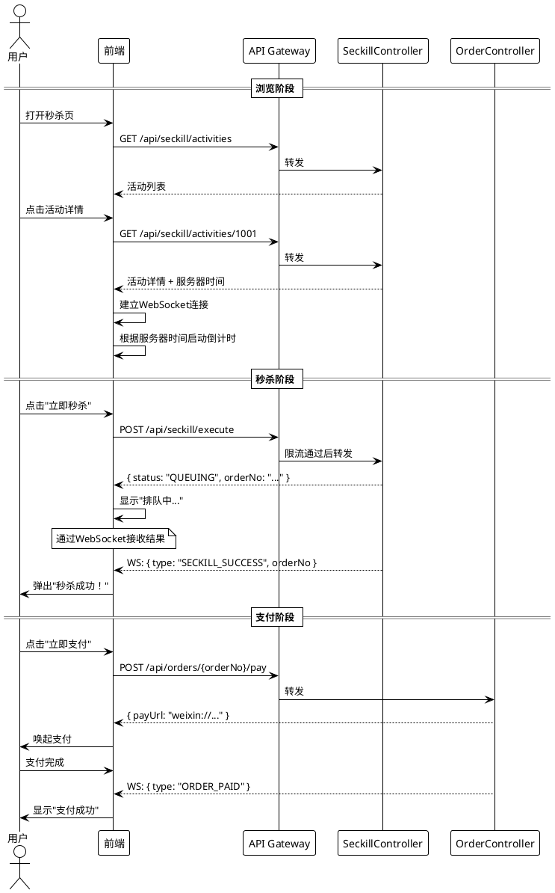

# 商品库存与秒杀系统 - API 接口设计

> 日期：2026/03/04
> 版本：v1.0

## 1. 接口规范

### 1.1 统一响应格式

```json
{
    "code": 200,
    "message": "success",
    "data": { ... },
    "timestamp": 1709539200000
}
```

### 1.2 错误码定义

| 错误码 | 含义 | HTTP Status |
|--------|------|-------------|
| 200 | 成功 | 200 |
| 400 | 参数错误 | 400 |
| 401 | 未登录 | 401 |
| 403 | 无权限 | 403 |
| 1001 | 活动不存在 | 200 |
| 1002 | 活动未开始 | 200 |
| 1003 | 活动已结束 | 200 |
| 1004 | 库存不足 | 200 |
| 1005 | 超出限购 | 200 |
| 1006 | 重复下单 | 200 |
| 1007 | 请求过于频繁 | 429 |
| 2001 | 订单不存在 | 200 |
| 2002 | 订单状态异常 | 200 |
| 5000 | 系统错误 | 500 |

## 2. 秒杀模块 API

### 2.1 获取秒杀活动列表

```
GET /api/seckill/activities
```

**请求参数**：

| 参数 | 类型 | 必填 | 说明 |
|------|------|------|------|
| status | Integer | 否 | 活动状态：0未开始 1进行中 2已结束 |
| page | Integer | 否 | 页码，默认1 |
| size | Integer | 否 | 每页大小，默认10 |

**响应示例**：

```json
{
    "code": 200,
    "data": {
        "list": [
            {
                "activityId": 1001,
                "name": "iPhone 限时秒杀",
                "productName": "iPhone 16 Pro",
                "originalPrice": 8999.00,
                "seckillPrice": 6999.00,
                "imageUrl": "/images/iphone16.jpg",
                "availableStock": 50,
                "totalStock": 100,
                "startTime": "2026-03-05T10:00:00",
                "endTime": "2026-03-05T10:30:00",
                "status": 0,
                "limitPerUser": 1
            }
        ],
        "total": 15,
        "page": 1,
        "size": 10
    }
}
```

### 2.2 获取秒杀活动详情

```
GET /api/seckill/activities/{activityId}
```

**响应示例**：

```json
{
    "code": 200,
    "data": {
        "activityId": 1001,
        "name": "iPhone 限时秒杀",
        "product": {
            "productId": 501,
            "name": "iPhone 16 Pro",
            "description": "Apple iPhone 16 Pro 256GB",
            "originalPrice": 8999.00,
            "imageUrl": "/images/iphone16.jpg"
        },
        "seckillPrice": 6999.00,
        "availableStock": 50,
        "totalStock": 100,
        "startTime": "2026-03-05T10:00:00",
        "endTime": "2026-03-05T10:30:00",
        "status": 0,
        "limitPerUser": 1,
        "serverTime": "2026-03-05T09:55:00"
    }
}
```

### 2.3 执行秒杀（核心接口）

```
POST /api/seckill/execute
```

**请求体**：

```json
{
    "activityId": 1001,
    "quantity": 1
}
```

**成功响应**：

```json
{
    "code": 200,
    "message": "秒杀成功，正在创建订单",
    "data": {
        "orderNo": "SK20260305100001001501",
        "status": "QUEUING"
    }
}
```

**失败响应示例**：

```json
{ "code": 1004, "message": "库存不足，秒杀失败" }
{ "code": 1005, "message": "超出限购数量" }
{ "code": 1007, "message": "请求过于频繁，请稍后再试" }
```

### 2.4 查询秒杀结果

```
GET /api/seckill/result?activityId=1001
```

**响应**：

```json
{
    "code": 200,
    "data": {
        "status": "SUCCESS",
        "orderNo": "SK20260305100001001501"
    }
}
```

status 可选值：`QUEUING`(排队中)、`SUCCESS`(成功)、`FAILED`(失败)

## 3. 商品模块 API

### 3.1 商品列表

```
GET /api/products?categoryId=1&page=1&size=20
```

### 3.2 商品详情

```
GET /api/products/{productId}
```

### 3.3 创建商品（管理员）

```
POST /api/admin/products
Content-Type: application/json

{
    "name": "iPhone 16 Pro",
    "description": "Apple iPhone 16 Pro 256GB",
    "price": 8999.00,
    "imageUrl": "/images/iphone16.jpg",
    "categoryId": 1
}
```

### 3.4 更新商品（管理员）

```
PUT /api/admin/products/{productId}
```

### 3.5 上下架商品（管理员）

```
PATCH /api/admin/products/{productId}/status
Content-Type: application/json

{
    "status": 0
}
```

## 4. 订单模块 API

### 4.1 查询我的订单

```
GET /api/orders?status=0&page=1&size=10
```

**响应**：

```json
{
    "code": 200,
    "data": {
        "list": [
            {
                "orderNo": "SK20260305100001001501",
                "productName": "iPhone 16 Pro",
                "seckillPrice": 6999.00,
                "quantity": 1,
                "totalAmount": 6999.00,
                "status": 0,
                "statusText": "待支付",
                "expireTime": "2026-03-05T10:15:00",
                "createdAt": "2026-03-05T10:00:01"
            }
        ],
        "total": 3
    }
}
```

### 4.2 查询订单详情

```
GET /api/orders/{orderNo}
```

### 4.3 支付订单

```
POST /api/orders/{orderNo}/pay
Content-Type: application/json

{
    "payMethod": "WECHAT"
}
```

**响应**：

```json
{
    "code": 200,
    "data": {
        "orderNo": "SK20260305100001001501",
        "payUrl": "weixin://pay/...",
        "expireSeconds": 300
    }
}
```

### 4.4 取消订单

```
POST /api/orders/{orderNo}/cancel
```

## 5. 活动管理 API（管理员）

### 5.1 创建秒杀活动

```
POST /api/admin/seckill/activities
Content-Type: application/json

{
    "name": "iPhone 限时秒杀",
    "productId": 501,
    "seckillPrice": 6999.00,
    "totalStock": 100,
    "startTime": "2026-03-05T10:00:00",
    "endTime": "2026-03-05T10:30:00",
    "limitPerUser": 1
}
```

### 5.2 修改秒杀活动

```
PUT /api/admin/seckill/activities/{activityId}
```

### 5.3 取消秒杀活动

```
POST /api/admin/seckill/activities/{activityId}/cancel
```

### 5.4 库存对账

```
GET /api/admin/seckill/activities/{activityId}/stock-check
```

**响应**：

```json
{
    "code": 200,
    "data": {
        "activityId": 1001,
        "redisStock": 48,
        "mysqlStock": 48,
        "consistent": true,
        "soldCount": 52,
        "orderCount": 52,
        "checkedAt": "2026-03-05T10:15:00"
    }
}
```

## 6. WebSocket 接口

### 6.1 连接端点

```
ws://host/ws/seckill/{activityId}?token={userToken}
```

### 6.2 服务端推送消息格式

```json
{
    "type": "STOCK_UPDATE",
    "data": {
        "activityId": 1001,
        "availableStock": 48
    },
    "timestamp": 1709539200000
}
```

### 6.3 消息类型

| type | 推送对象 | data 内容 |
|------|---------|----------|
| STOCK_UPDATE | 活动页全体 | { availableStock } |
| STOCK_EMPTY | 活动页全体 | {} |
| SECKILL_SUCCESS | 当前用户 | { orderNo, expireTime } |
| SECKILL_FAILED | 当前用户 | { reason } |
| ORDER_PAID | 当前用户 | { orderNo } |
| ORDER_TIMEOUT | 当前用户 | { orderNo } |
| COUNTDOWN | 活动页全体 | { secondsRemaining } |

## 7. 接口调用时序


