# 商品库存与秒杀系统 - 页面原型设计

> 日期：2026/03/04
> 版本：v1.0

## 1. 页面结构总览

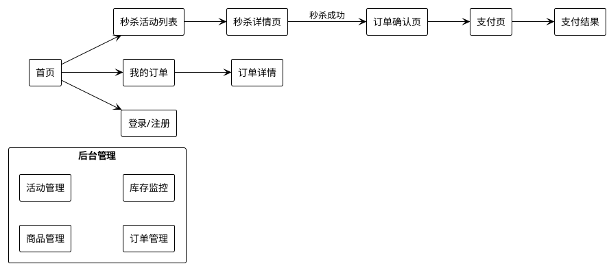

## 2. 首页

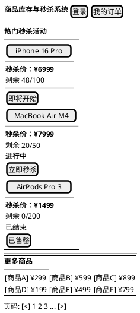

## 3. 秒杀活动列表页

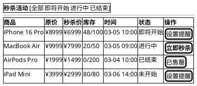

## 4. 秒杀详情页（核心页面）

### 4.1 秒杀未开始状态

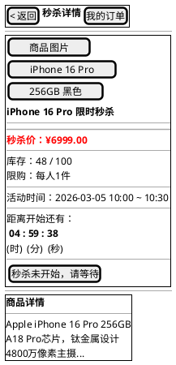

### 4.2 秒杀进行中状态

```plantuml
@startsalt
{
    {+
        [< 返回] | **秒杀详情** | [我的订单]
    }
    --
    {+
        {
            [    商品图片    ]
        }
        |
        {
            <b>iPhone 16 Pro 限时秒杀</b>
            ---
            <b><color:red>秒杀价：¥6999.00</color></b>
            ---
            库存：<b><color:red>48</color></b> / 100
            [====------    ] 48%
            限购：每人1件
            ---
            活动剩余时间：
            <b> 00 : 25 : 12 </b>
            ---
            { [<b>  立即秒杀  </b>] }
        }
    }
}
@endsalt
```

### 4.3 秒杀排队中状态

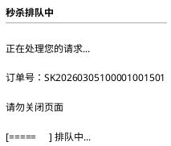

### 4.4 秒杀结果弹窗

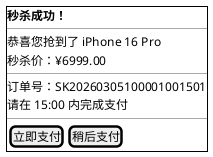

## 5. 订单确认页

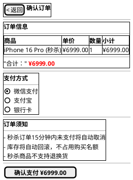

## 6. 我的订单页

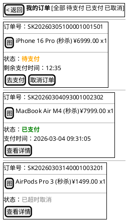

## 7. 后台管理 - 活动管理

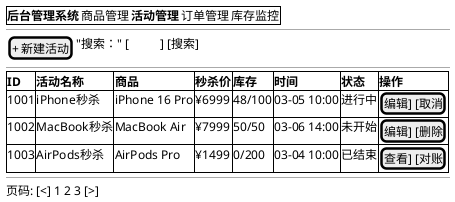

## 8. 后台管理 - 库存监控

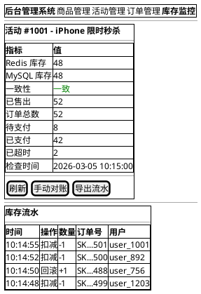

## 9. 页面交互流程

```plantuml
@startuml page-flow
!theme plain

(*) --> "首页"
"首页" --> "登录/注册" : 未登录点击秒杀
"登录/注册" --> "首页" : 登录成功

"首页" --> "秒杀活动列表"
"秒杀活动列表" --> "秒杀详情页"

"秒杀详情页" --> "倒计时等待" : 活动未开始
"倒计时等待" --> "秒杀详情页" : 倒计时结束

"秒杀详情页" --> "排队等待遮罩" : 点击秒杀
"排队等待遮罩" --> "秒杀成功弹窗" : WebSocket通知成功
"排队等待遮罩" --> "秒杀失败弹窗" : WebSocket通知失败

"秒杀成功弹窗" --> "订单确认页" : 立即支付
"秒杀成功弹窗" --> "我的订单" : 稍后支付

"订单确认页" --> "支付页面" : 确认支付
"支付页面" --> "支付成功页" : 支付完成
"支付页面" --> "我的订单" : 取消支付

"我的订单" --> "订单详情"
"我的订单" --> "支付页面" : 去支付（待支付订单）

"首页" --> "我的订单"

@enduml
```

## 10. 前端技术方案

| 层面 | 方案 | 说明 |
|------|------|------|
| 页面渲染 | Thymeleaf 模板 或 Vue.js SPA | 根据团队技术栈选择 |
| 实时通讯 | 原生 WebSocket API | 接收库存变化和秒杀结果 |
| 倒计时 | 服务器时间校准 + 本地计时器 | 防止客户端时间篡改 |
| 秒杀按钮 | 禁止重复点击 + Loading状态 | 防止用户多次提交 |
| 请求限流 | 前端节流（1秒内最多1次） | 减少无效请求 |
| 错误提示 | Toast 消息 | 统一错误展示 |
